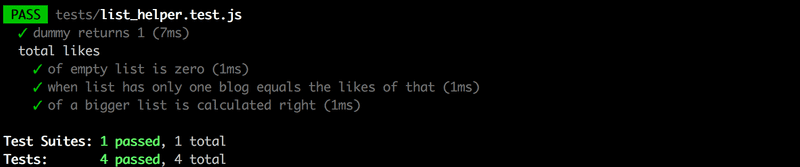
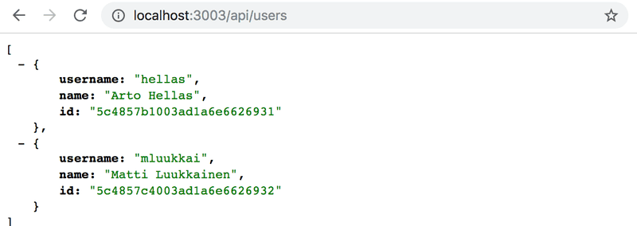

# This repository contains the [Full Stack Open course](https://fullstackopen.com/) part4 exercises

**All exercises are saved in a separate commit.**

## Exercises 4.1.-4.2

**Note:** this course material was written with version v20.11.0 of Node.js. Please make sure that your version of Node is at least as new as the version used in the material (you can check the version by running `node -v` in the command line).

In the exercises for this part, we will be building a _blog list application_, that allows users to save information about interesting blogs they have stumbled across on the internet. For each listed blog we will save the author, title, URL, and amount of upvotes from users of the application.

## 4.1 Blog List, step 1

Let's imagine a situation, where you receive an email that contains the following application body and instructions:

```js
const express = require('express');
const app = express();
const cors = require('cors');
const mongoose = require('mongoose');

const blogSchema = new mongoose.Schema({
  title: String,
  author: String,
  url: String,
  likes: Number,
});

const Blog = mongoose.model('Blog', blogSchema);

const mongoUrl = 'mongodb://localhost/bloglist';
mongoose.connect(mongoUrl);

app.use(cors());
app.use(express.json());

app.get('/api/blogs', (request, response) => {
  Blog.find({}).then((blogs) => {
    response.json(blogs);
  });
});

app.post('/api/blogs', (request, response) => {
  const blog = new Blog(request.body);

  blog.save().then((result) => {
    response.status(201).json(result);
  });
});

const PORT = 3003;
app.listen(PORT, () => {
  console.log(`Server running on port ${PORT}`);
});
```

Turn the application into a functioning _npm_ project. To keep your development productive, configure the application to be executed with nodemon. You can create a new database for your application with MongoDB Atlas, or use the same database from the previous part's exercises.

Verify that it is possible to add blogs to the list with Postman or the VS Code REST client and that the application returns the added blogs at the correct endpoint.

### 4.2 Blog List, step 2

Refactor the application into separate modules as shown earlier in this part of the course material.

**NB** refactor your application in baby steps and verify that it works after every change you make. If you try to take a "shortcut" by refactoring many things at once, then [Murphy's law](https://en.wikipedia.org/wiki/Murphy%27s_law) will kick in and it is almost certain that something will break in your application. The "shortcut" will end up taking more time than moving forward slowly and systematically.

One best practice is to commit your code every time it is in a stable state. This makes it easy to rollback to a situation where the application still works.

If you're having issues with _content.body_ being undefined for seemingly no reason, make sure you didn't forget to add _app.use(express.json())_ near the top of the file.

## Exercises 4.3.-4.7

Let's create a collection of helper functions that are best suited for working with the describe sections of the blog list. Create the functions into a file called _utils/list_helper.js_. Write your tests into an appropriately named test file under the tests directory.

### 4.3: Helper Functions and Unit Tests, step 1

First, define a dummy function that receives an array of blog posts as a parameter and always returns the value 1. The contents of the _list_helper.js_ file at this point should be the following:

```js
const dummy = (blogs) => {
  // ...
};

module.exports = {
  dummy,
};
```

Verify that your test configuration works with the following test:

```js
const { test, describe } = require('node:test');
const assert = require('node:assert');
const listHelper = require('../utils/list_helper');

test('dummy returns one', () => {
  const blogs = [];

  const result = listHelper.dummy(blogs);
  assert.strictEqual(result, 1);
});
```

### 4.4: Helper Functions and Unit Tests, step 2

Define a new `totalLikes` function that receives a list of blog posts as a parameter. The function returns the total sum of _likes_ in all of the blog posts.

Write appropriate tests for the function. It's recommended to put the tests inside of a _describe_ block so that the test report output gets grouped nicely:



Defining test inputs for the function can be done like this:

```js
describe('total likes', () => {
  const listWithOneBlog = [
    {
      _id: '5a422aa71b54a676234d17f8',
      title: 'Go To Statement Considered Harmful',
      author: 'Edsger W. Dijkstra',
      url: 'https://homepages.cwi.nl/~storm/teaching/reader/Dijkstra68.pdf',
      likes: 5,
      __v: 0,
    },
  ];

  test('when list has only one blog, equals the likes of that', () => {
    const result = listHelper.totalLikes(listWithOneBlog);
    assert.strictEqual(result, 5);
  });
});
```

If defining your own test input list of blogs is too much work, you can use the ready-made list [here](https://github.com/fullstack-hy2020/misc/blob/master/blogs_for_test.md).

You are bound to run into problems while writing tests. Remember the things that we learned about [debugging](https://fullstackopen.com/en/part3/saving_data_to_mongo_db#debugging-node-applications) in part 3. You can print things to the console with `console.log` even during test execution.

### 4.5\*: Helper Functions and Unit Tests, step 3

**NB** when you are comparing objects, the [deepStrictEqual](https://nodejs.org/api/assert.html#assertdeepstrictequalactual-expected-message) method is probably what you want to use, since the [strictEqual](https://nodejs.org/api/assert.html#assertstrictequalactual-expected-message) tries to verify that the two values are the same value, and not just that they contain the same properties. For differences between various assert module functions, you can refer to this [Stack Overflow answer](https://stackoverflow.com/questions/16745855/difference-between-equal-deep-equal-and-strict-equal/73937068#73937068).

Write the tests for this exercise inside of a new _describe_ block. Do the same for the remaining exercises as well.

### 4.6\*: Helper Functions and Unit Tests, step 4

This and the next exercise are a little bit more challenging. Finishing these two exercises is not required to advance in the course material, so it may be a good idea to return to these once you're done going through the material for this part in its entirety.

Finishing this exercise can be done without the use of additional libraries. However, this exercise is a great opportunity to learn how to use the [Lodash](https://lodash.com/) library.

Define a function called `mostBlogs` that receives an array of blogs as a parameter. The function returns the _author_ who has the largest amount of blogs. The return value also contains the number of blogs the top author has:

```js
{
  author: "Robert C. Martin",
  blogs: 3
}
```

If there are many top bloggers, then it is enough to return any one of them.

### 4.7\*: Helper Functions and Unit Tests, step 5

Define a function called `mostLikes` that receives an array of blogs as its parameter. The function returns the author, whose blog posts have the largest amount of likes. The return value also contains the total number of likes that the author has received:

```js
{
  author: "Edsger W. Dijkstra",
  likes: 17
}
```

If there are many top bloggers, then it is enough to show any one of them.

## Exercises 4.8.-4.12

**Warning:** If you find yourself using _async/await_ and _then_ methods in the same code, it is almost guaranteed that you are doing something wrong. Use one or the other and don't mix the two.

### 4.8: Blog List Tests, step 1

Use the SuperTest library for writing a test that makes an HTTP GET request to the _/api/blogs_ URL. Verify that the blog list application returns the correct amount of blog posts in the JSON format.

Once the test is finished, refactor the route handler to use the _async/await_ syntax instead of promises.

Notice that you will have to make similar changes to the code that were made [in the material](https://fullstackopen.com/en/part4/testing_the_backend#test-environment), like defining the test environment so that you can write tests that use separate databases.

**NB:** when you are writing your tests **it is better to not execute them all**, only execute the ones you are working on. Read more about this [here](https://fullstackopen.com/en/part4/testing_the_backend#running-tests-one-by-one).

### 4.9: Blog List Tests, step 2

Write a test that verifies that the unique identifier property of the blog posts is named _id_, by default the database names the property \__id_.

Make the required changes to the code so that it passes the test. The [toJSON](https://fullstackopen.com/en/part3/saving_data_to_mongo_db#connecting-the-backend-to-a-database) method discussed in part 3 is an appropriate place for defining the _id_ parameter.

### 4.10: Blog List Tests, step 3

Write a test that verifies that making an HTTP POST request to the _/api/blogs_ URL successfully creates a new blog post. At the very least, verify that the total number of blogs in the system is increased by one. You can also verify that the content of the blog post is saved correctly to the database.

Once the test is finished, refactor the operation to use _async/await_ instead of promises.

### 4.11\*: Blog List Tests, step 4

Write a test that verifies that if the _likes_ property is missing from the request, it will default to the value 0. Do not test the other properties of the created blogs yet.

Make the required changes to the code so that it passes the test.

### 4.12\*: Blog List tests, step 5

Write tests related to creating new blogs via the _/api/blogs_ endpoint, that verify that if the _title_ or _url_ properties are missing from the request data, the backend responds to the request with the status code _400_ Bad Request.

Make the required changes to the code so that it passes the test.

## Exercises 4.13.-4.14

### 4.13 Blog List Expansions, step 1

Implement functionality for deleting a single blog post resource.

Use the _async/await_ syntax. Follow [RESTful](https://fullstackopen.com/en/part3/node_js_and_express#rest) conventions when defining the HTTP API.

Implement tests for the functionality.

### 4.14 Blog List Expansions, step 2

Implement functionality for updating the information of an individual blog post.

Use _async/await_.

The application mostly needs to update the number of _likes_ for a blog post. You can implement this functionality the same way that we implemented updating notes in [part 3](https://fullstackopen.com/en/part3/saving_data_to_mongo_db#other-operations).

Implement tests for the functionality.

## Exercises 4.15.-4.23

In the next exercises, the basics of user management will be implemented for the Bloglist application. The safest way is to follow the course material from part 4 chapter [User administration](https://fullstackopen.com/en/part4/user_administration) to the chapter [Token authentication](https://fullstackopen.com/en/part4/token_authentication). You can of course also use your creativity.

**One more warning:** If you notice you are mixing _async/await_ and then calls, it is 99% certain you are doing something wrong. Use either or, never both.

### 4.15: Blog List Expansion, step 3

Implement a way to create new users by doing an HTTP POST request to address _api/users_. Users have a _username_, _password_ and _name_.

Do not save passwords to the database as clear text, but use the _bcrypt_ library like we did in part 4 chapter [Creating users](https://fullstackopen.com/en/part4/user_administration#creating-users).

**NB** Some Windows users have had problems with _bcrypt_. If you run into problems, remove the library with command

```bash
npm uninstall bcrypt
```

and install [bcryptjs](https://www.npmjs.com/package/bcryptjs) instead.

Implement a way to see the details of all users by doing a suitable HTTP request.

The list of users can, for example, look as follows:


